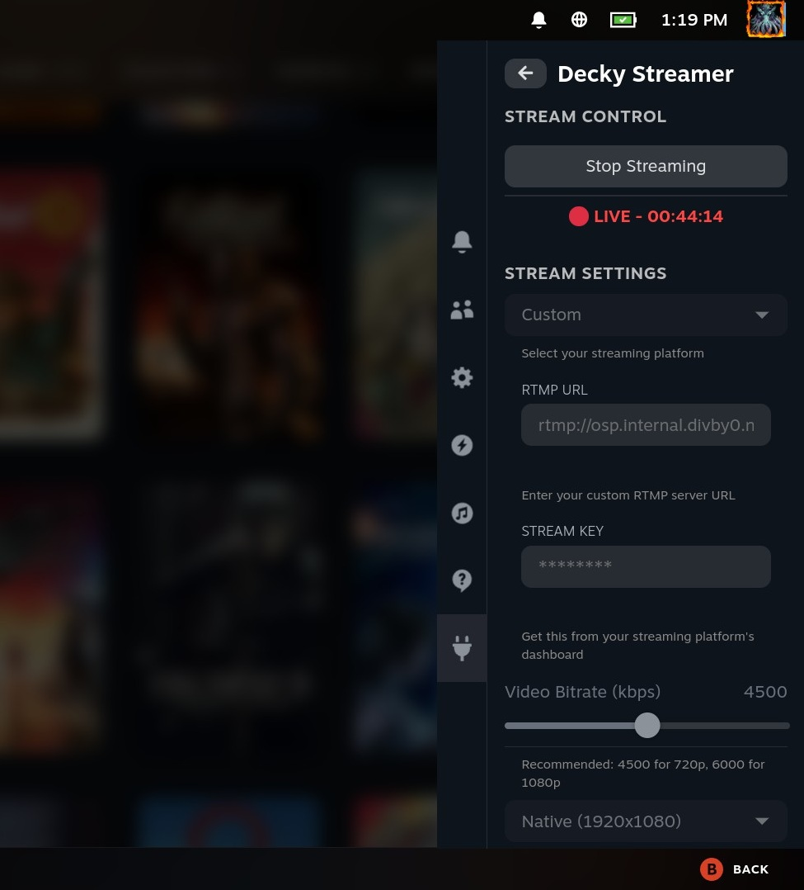

# Decky Streamer

A Decky Loader plugin for streaming Steam Deck gameplay to RTMP endpoints like Twitch, YouTube Live, Kick, and other streaming platforms.

Based on [decky-recorder-fork](https://github.com/SDH-Stewardship/decky-recorder-fork) by marissa999/safijari.

## Features

- **Platform Presets**: One-click setup for Twitch, YouTube, Kick, Facebook, or custom RTMP servers
- **Hardware-accelerated H.264 encoding** using VAAPI for efficient streaming
- **Configurable video settings**:
  - Bitrate: 1000-8000 kbps
  - Resolution: Native (auto-detected), 720p, 800p, or 1080p
  - Framerate: 30 or 60 fps
- **Audio settings**:
  - Bitrate options: 96, 128, 160, 192, or 256 kbps
- **Advanced encoder options** (optional):
  - Keyframe interval (GOP size)
  - B-frames for improved compression
- **Microphone support** with echo cancellation
- **Optional enhanced noise cancellation** (requires additional binary)
- **Live stream duration indicator**

## Requirements

- Steam Deck with Decky Loader installed
- Node.js 18+ (for building from source)
- pnpm (for building from source)
- Docker (for building from source)
- jq (for building from source)

## Screenshot


## Installation

### From Release ZIP

1. Download the latest `decky-streamer.zip` from releases
2. Open Decky Loader settings on your Steam Deck
3. Go to the "Developer" section
4. Click "Install Plugin From ZIP"
5. Select the downloaded ZIP file

### Building from Source

1. Initialize the project:
   ```bash
   make init
   ```

2. Edit the `.env` file with your Steam Deck's IP/hostname:
   ```
   DECK_USER=deck
   DECK_HOST=<your-steamdeck-ip>
   DECK_PORT=22
   DECK_HOME=/home/deck
   DECK_KEY=~/.ssh/id_rsa
   ```

3. Copy your SSH key to the Steam Deck:
   ```bash
   make copy-ssh-key
   ```

4. Build the plugin:
   ```bash
   make build
   ```

5. Deploy to your Steam Deck:
   ```bash
   make deploy
   ```

Or do it all in one step (after init):
```bash
make it
```

## Usage

1. Open the Decky menu on your Steam Deck

2. Find "Decky Streamer" in the plugin list

3. Configure your stream settings:
   - **Platform**: Select your streaming platform (Twitch, YouTube, etc.) or "Custom" for other RTMP servers
   - **Stream Key**: Your secret stream key from your streaming platform's dashboard
   - **Video Bitrate**: Higher = better quality but more bandwidth
     - 4500 kbps recommended for 720p60
     - 6000 kbps recommended for 1080p60
   - **Resolution**: 720p recommended for stable streaming
   - **Framerate**: 60 fps for smooth gameplay, 30 fps for lower bandwidth
   - **Audio Bitrate**: 160 kbps is a good default

4. (Optional) Enable "Show Advanced Options" for:
   - **Keyframe Interval**: Controls how often full frames are sent (affects seeking/quality)
   - **B-Frames**: Improves compression quality but adds slight latency

5. Press "Start Streaming" to go live!

## Platform RTMP URLs

The plugin includes built-in presets for these platforms:

| Platform | RTMP URL (built-in) |
|----------|---------------------|
| Twitch | `rtmp://ingest.global-contribute.live-video.net/app` |
| YouTube | `rtmp://a.rtmp.youtube.com/live2` |
| Kick | `rtmp://fa723fc1b171.global-contribute.live-video.net/app` |
| Facebook | `rtmps://live-api-s.facebook.com:443/rtmp` |

For custom RTMP servers, select "Custom" and enter your server URL.

## Enhanced Noise Cancellation (Optional)

For better microphone noise cancellation, you can download an enhanced binary:

```bash
# Download GPL-3 binary for superior denoising
denoise_version="1.03"
denoise_zip_url="https://github.com/werman/noise-suppression-for-voice/releases/download/v${denoise_version}/linux-rnnoise.zip"
denoise_zip_file_path="/home/deck/homebrew/data/decky-streamer/linux-rnnoise.zip"
denoise_extracted_file_path="/home/deck/homebrew/data/decky-streamer/librnnoise_ladspa.so"

mkdir -p /home/deck/homebrew/data/decky-streamer
wget "${denoise_zip_url}" -O "${denoise_zip_file_path}"
unzip -j "${denoise_zip_file_path}" 'linux-rnnoise/ladspa/librnnoise_ladspa.so' -d /tmp
mv /tmp/librnnoise_ladspa.so "${denoise_extracted_file_path}"
```

After installing, restart the microphone toggle to see noise reduction options.

## Troubleshooting

### Stream won't start
- Verify your stream key is correct
- Check that your platform's RTMP URL is accessible
- Ensure you have a stable internet connection
- Check the plugin logs at `~/homebrew/logs/decky-streamer/`

### Black screen / No video
- Try restarting the stream
- Check the plugin logs at `~/homebrew/logs/decky-streamer/`

### Poor stream quality
- Reduce video bitrate if your upload speed is limited
- Try 720p resolution instead of 1080p
- Use 30 fps instead of 60 fps to reduce bandwidth
- Close other network-intensive applications

### Audio issues
- Make sure game audio is playing through the default output
- If using microphone, try adjusting the gain
- Check that the correct microphone source is selected

### Settings not saving
- Settings are saved when you change them
- If issues persist, try reloading the plugin from Decky settings

## License

BSD-3-Clause (same as decky-recorder-fork)

## Acknowledgments

- [decky-recorder-fork](https://github.com/SDH-Stewardship/decky-recorder-fork) by marissa999/safijari
- [Recapture Plugin](https://git.sr.ht/~avery/recapture) by Avery
- [Decky Loader](https://github.com/SteamDeckHomebrew/decky-loader) team
